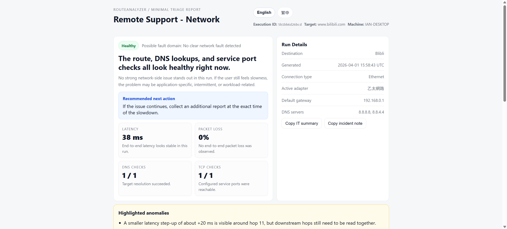

# Route Analyzer

一個 client-side 網路狀態診斷工具。

目標不是取代完整監控或 APM，而是讓 user 回報「連線很慢」「VPN 很卡」「網站連不上」時，能在 client-side 快速收一份診斷報告。

## Demo




輸出 summary：

- 整體狀態
- 可能的 fault domain
- 下一步建議
- DNS / TCP / route 訊號
- 可展之完整 traceroute 與明細

## 快速開始

如果目前目錄或 EXE 同層有 `routeanalyzer.profile.json`，直接執行就會使用該 profile：

```powershell
RouteAnalyzer.Cli.exe
```

用指定 profile 執行：

```powershell
dotnet run --project RouteAnalyzer.Cli -- --profile-file .\routeanalyzer.profile.json
```

臨時測一個目標：

```powershell
dotnet run --project RouteAnalyzer.Cli -- --target vpn.example.com
```

只要 console，不自動開報表：

```powershell
dotnet run --project RouteAnalyzer.Cli -- --target vpn.example.com --console-only --no-open
```

產生一份 sample profile：

```powershell
dotnet run --project RouteAnalyzer.Cli -- --create-sample-profile
```

## Profile 概念

這個工具比較適合 profile-driven 的使用方式。

你可以把固定要檢查的目標、DNS lookup、TCP port 都寫進 profile，之後 helpdesk 或使用者只要跑一次，就能得到比較一致的報告。

範例檔案：[`routeanalyzer.profile.example.json`](/e:/Biker/Code/RouteAnalyzer/routeanalyzer.profile.example.json)

目前 profile 會用到這幾個核心欄位：

- `profileName`
- `destinationName`
- `targetHost`
- `dnsLookups`
- `tcpEndpoints`

## 會產出什麼

每次執行預設會產生一個報告資料夾，並自動開啟 `report.html`。

內容包含：

- `summary.txt`
  - 短摘要
- `report.json`
  - 後續分析或程式處理使用
- `report.html`
  - 直觀閱讀使用
- `route-hops.csv`
  - network hop 明細


## CLI 參數

- `--profile-file <path>`
- `--target <value>`
- `--ping-count <3-10>`
- `--max-hops <4-64>`
- `--format <bundle|text|json|csv|html>`
- `--output <path>`
- `--report-dir <path>`
- `--console-only`
- `--language <en|zh-TW>`
- `--create-sample-profile [path]`
- `--force`
- `--no-geo`
- `--no-open`
- `--help`

## Build / Publish

本機驗證：

```powershell
dotnet build RouteAnalyzer.sln
dotnet test RouteAnalyzer.sln
```

輸出 Windows EXE：

```powershell
./scripts/publish-cli.ps1 -Runtime win-x64 -Configuration Release
```

prodution menu : `artifacts/cli/<runtime>`。