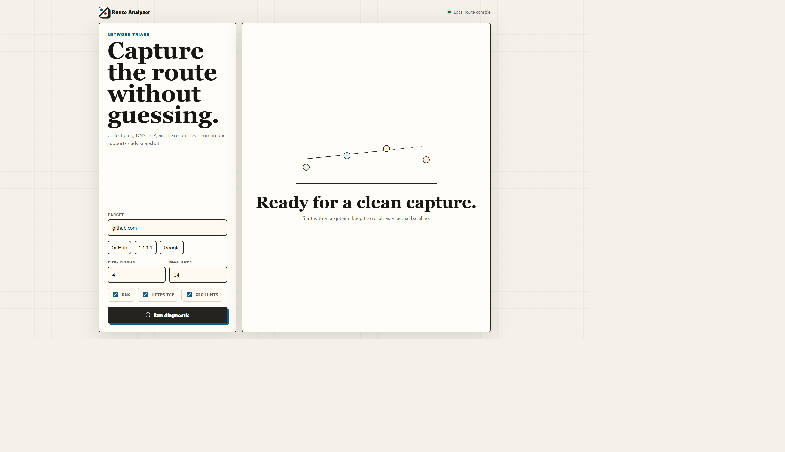
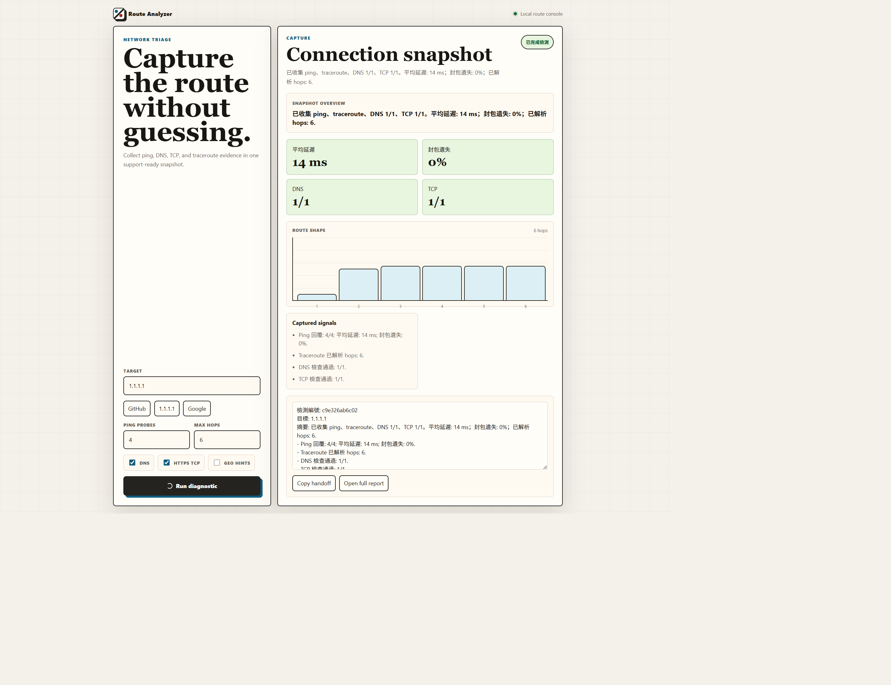

# Route Analyzer

輕量的 local-first 網路檢測與視覺化工具。

Route Analyzer 不負責猜測「誰的網路壞了」。它只快速收集可檢查、可轉交、可重跑的事實訊號：ping、packet loss、DNS、TCP、traceroute hops、本機網卡資訊，然後整理成一份支援用 snapshot。

## 使用方式

使用者不需要安裝 .NET，不需要打指令，也不需要 `dotnet build`。

1. 從 GitHub Release 下載 `RouteAnalyzer.exe`。
2. 雙擊 `RouteAnalyzer.exe`。
3. 瀏覽器會自動開啟本機檢測頁。
4. 輸入目標，例如 `vpn.company.com`、`github.com`、`1.1.1.1`。
5. 按 `Run diagnostic`。

檢測結果會存在 exe 同層的 `reports/app/<report-id>/`。

## 畫面

啟動後直接進入檢測畫面：



完成後會看到 connection snapshot、route shape、captured signals，以及可複製給 support / IT 的摘要：



## App 會檢測什麼

- ping average / packet loss / jitter
- DNS lookup 是否成功
- TCP port 是否可連
- traceroute hop 明細
- hop timeout 與 latency step-up 標記
- 本機連線資訊，例如 adapter、gateway、DNS servers
- HTML / JSON / CSV / text report

## 不做什麼

Route Analyzer 不做 rule-based fault domain 判斷。

它不會宣稱問題一定是 Wi-Fi、ISP、transit 或目的端服務。這些結論很容易不準，也很難維護。工具只呈現檢測訊號。

## 給維護者

本機產生單一 Windows app：

```powershell
./scripts/publish-app.ps1 -Runtime win-x64 -Configuration Release
```

輸出：

```text
artifacts/app/win-x64/RouteAnalyzer.exe
```

GitHub Actions 也可以手動執行 `Publish portable app` workflow。推 `v*` tag 時會把 `RouteAnalyzer.exe` 放到 GitHub Release。

## 開發

```powershell
dotnet build RouteAnalyzer.sln
dotnet test RouteAnalyzer.sln
```

本機跑 app：

```powershell
dotnet run --project RouteAnalyzer.App --urls http://localhost:5015
```

## CLI

CLI 保留給進階或自動化情境。

使用 profile：

```powershell
RouteAnalyzer.Cli.exe --profile-file .\routeanalyzer.profile.json
```

快速測目標：

```powershell
RouteAnalyzer.Cli.exe --target github.com
```

產生 sample profile：

```powershell
RouteAnalyzer.Cli.exe --create-sample-profile
```
